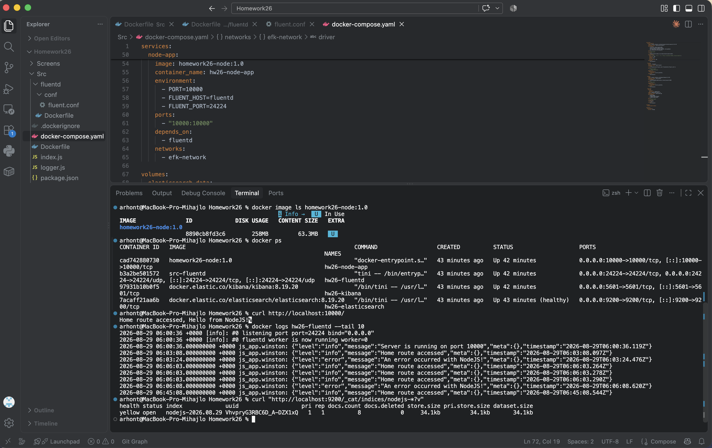
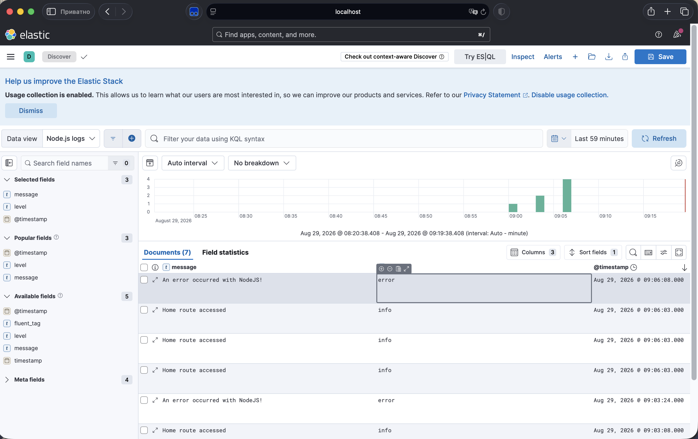

# Homework26 — Monitoring and logging

## Мета роботи

Створити Docker-образ для Node.js застосунку, запустити стек EFK за допомогою Docker Compose та налаштувати передавання логів застосунку до Elasticsearch через Fluentd. Перевірити отримані логи в Kibana.

## Виконано

- створено Docker-образ Node.js застосунку;
- підготовлено файл `docker-compose.yaml`;
- запущено Elasticsearch, Fluentd, Kibana та Node.js застосунок;
- налаштовано передавання логів із Node.js до Fluentd;
- налаштовано збереження логів у Elasticsearch;
- створено Data View `nodejs-*` у Kibana;
- перевірено відображення логів рівнів `info` та `error`.

## Структура проєкту

```text
Homework26
├── Src
│   ├── Dockerfile
│   ├── .dockerignore
│   ├── docker-compose.yaml
│   ├── index.js
│   ├── logger.js
│   ├── package.json
│   └── fluentd
│       ├── Dockerfile
│       └── conf
│           └── fluent.conf
├── Screens
│   ├── EFK_run.png
│   └── kibana_log.png
├── .gitignore
└── README.md
```

## Компоненти

- **Node.js** — створює логи рівнів `info` та `error`.
- **Fluentd** — приймає логи застосунку і передає їх до Elasticsearch.
- **Elasticsearch** — зберігає та індексує отримані логи.
- **Kibana** — використовується для пошуку і перегляду логів.

## Запуск

Перебуваючи в папці `Homework26`, виконати:

```bash
docker compose -f Src/docker-compose.yaml up -d --build
```

Перевірити контейнери:

```bash
docker compose -f Src/docker-compose.yaml ps
```

## Перевірка застосунку

Застосунок доступний на порту `10000`.

Успішний запит:

```bash
curl http://localhost:10000/
```

Запит, який створює лог помилки:

```bash
curl -i http://localhost:10000/error
```

Маршрут `/` створює лог рівня `info`, а `/error` — лог рівня `error`.

## Перевірка Elasticsearch

Перегляд створеного індексу:

```bash
curl "http://localhost:9200/_cat/indices/nodejs-*?v"
```

Логи зберігаються в індексі з шаблоном:

```text
nodejs-*
```

## Перевірка Kibana

Kibana доступна за адресою:

```text
http://localhost:5601
```

Для перегляду логів створено Data View:

```text
nodejs-*
```

У Kibana відображаються поля:

- `@timestamp`;
- `level`;
- `message`.

## Скріншоти

### Запуск і робота EFK-стека



### Логи Node.js у Kibana



## Зупинка

Зупинити контейнери:

```bash
docker compose -f Src/docker-compose.yaml down
```

Зупинити контейнери та видалити том Elasticsearch:

```bash
docker compose -f Src/docker-compose.yaml down -v
```

## Висновок

Створено Docker-образ Node.js застосунку та запущено EFK-стек. Логи успішно передаються через Fluentd до Elasticsearch і відображаються в Kibana.